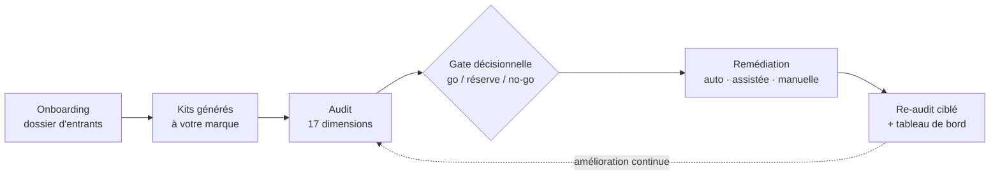

# Manuel entreprise — AuditCore

> Guide de lecture pour une direction des systèmes d'information, un COMEX ou une direction de
> programme : ce que le parcours d'audit et de remédiation **AuditCore** livre concrètement,
> étape par étape, sans détail d'implémentation. Pour la mise en œuvre technique, voir
> `README.md` et `CHANGELOG.md` du même dépôt.

## Vue d'ensemble du parcours

Quatre étapes, un point de contrôle humain à l'onboarding (validation de votre configuration) et
deux points de contrôle humain dans la remédiation (revue du backlog, revue de fusion).

## 1. Ce que vous obtenez

- **Un audit exhaustif sur 17 dimensions** (17 grands domaines de jugement — fonctionnel,
  architecture, sécurité, données & IA, FinOps, opérations) : la valeur métier, la dette
  technique, la conformité réglementaire et les coûts sont couverts par le même exercice.
- **Des kits personnalisés à votre marque** — un **kit** est une archive prête à l'emploi,
  générée automatiquement une fois votre configuration validée.
- **Un plan de remédiation priorisé**, dont une partie est automatisable par un outil de
  correction externe — jamais promise à l'avance : mesurée après coup.
- **Un re-audit de vérification**, qui rejoue les points corrigés pour confirmer que l'écart est
  réellement refermé.

Le même référentiel s'applique à six types de projets (application web, API, plateforme de
données, mobile, IA/ML, infrastructure) : chaque contrôle indique s'il s'applique pleinement,
partiellement, ou pas du tout à votre cas.

## 2. Étape 1 · Onboarding

**Vous fournissez le dossier d'entrants** : documents de marque, contraintes internes déjà en
vigueur, décisions d'architecture existantes, rôles et environnements nommés. Le détail de ce
qu'il faut préparer est décrit dans `docs/ONBOARDING-ENTRANTS.md`.

**Un agent IA transforme ce dossier en configuration.** Cette configuration est votre
**overlay** : la surcouche propre à votre entreprise (branding, rôles, contraintes, sources
documentaires) qui personnalise le **core** — le socle générique et versionné du référentiel,
commun à tous les clients, jamais modifié directement. Un overlay peut ajouter une exigence ou
en durcir une existante ; il ne peut jamais en supprimer ou en affaiblir une jugée invariante —
toute exception est tracée et visible dans le rapport, jamais silencieuse. Des **profils**
techniques (des compléments qui traduisent une exigence générique dans vos technologies — coffre
à secrets Azure, lakehouse Databricks, Power BI, Elastic…) s'ajoutent si votre système
d'information les utilise. Un contrôle automatique vérifie d'abord que la configuration proposée
est structurellement valide.

**Vous approuvez la configuration finale.** C'est le premier point de contrôle humain du
parcours : rien n'est engagé pour votre compte sans cette validation explicite.

**Vos kits sont générés à votre marque.** Deux kits sont produits à partir de la configuration
validée : un kit « conformité », pour l'équipe du projet audité (contraintes applicables, banc de
preuves, un vérificateur autonome, une fiche sécurité, le thème visuel), et un kit « audit », pour
l'équipe qui conduit l'audit.

## 3. Étape 2 · Audit

**Méthode.** Chaque audit part d'une **feuille blanche** : il ne reprend pas les conclusions
d'un audit antérieur, il constate l'état réel au moment de l'audit. Règle d'or : **pas de score
sans preuve** — un **contrôle** (un critère vérifiable, associé à une preuve attendue et une
grille de verdict) n'est jugé conforme que si une preuve existe, citée à l'endroit précis où elle
a été vérifiée (**preuve fichier:ligne** : fichier et ligne de code, extrait de configuration,
rapport de scan ou capture d'écran — jamais une affirmation non sourcée).

**Les 17 dimensions, en langage métier :**

| ID | Dimension | Ce que ça vous demande, en clair |
|---|---|---|
| D00 | Périmètre fonctionnel & valeur métier | Le produit répond-il à un besoin métier clair, mesuré, à périmètre explicite ? |
| D01 | Architecture cible | L'architecture tiendra-t-elle l'évolution sans tout reconstruire ? |
| D02 | Sécurité applicative | L'application résiste-t-elle aux attaques courantes ? |
| D03 | IAM & gestion des secrets | Qui peut accéder à quoi, et vos mots de passe/clés sont-ils protégés ? |
| D04 | Conformité réglementaire & IA | Êtes-vous en règle vis-à-vis du RGPD et des obligations sur l'IA ? |
| D05 | Données & qualité | Pouvez-vous faire confiance aux données que le système produit ? |
| D06 | Performance & charge | Le système tient-il si l'usage double ou triple ? |
| D07 | Coûts & FinOps | Savez-vous ce que ça coûte, et pourriez-vous en dépenser moins ? |
| D08 | Tests & qualité de code | Le code est-il testé, ou chaque changement est-il un pari ? |
| D09 | CI/CD & DevOps | Une mise en production est-elle un évènement maîtrisé ou un risque ? |
| D10 | Observabilité & logs | Sauriez-vous détecter un incident avant vos utilisateurs ? |
| D11 | UX & accessibilité | Le produit est-il utilisable par tous, y compris en situation de handicap ? |
| D12 | Run & exploitation | Qui répond en cas de panne, et à quel coût pour l'activité ? |
| D13 | Documentation | Un nouvel arrivant peut-il reprendre le système sans dépendre d'une seule personne ? |
| D14 | Modèles IA & prompts | Vos modèles d'IA sont-ils choisis, évalués, surveillés — ou déployés à l'aveugle ? |
| D15 | Principes data by design | Vos données sont-elles gouvernées dès la conception, ou rattrapées après coup ? |
| D16 | Schéma de base de données | Votre base est-elle documentée, cohérente, et sait-on où sont les données sensibles ? |

**Scoring.** Chaque dimension applicable reçoit une note de 1 à 5 (1 Bloquant, 2 Insuffisant, 3
Acceptable, 4 Solide, 5 État de l'art) et un score global (moyenne pondérée sur les 17
dimensions). Chaque contrôle porte aussi une **criticité** (Standard, Majeur, Bloquant, Fatal) et
un niveau de contrainte (**enforcement** : recommandation, conseillé, obligatoire ou bloquant).

**Gate décisionnelle.** Une première revue (Gate consultative) est informative. La **Gate
décisionnelle**, elle, est tranchée par votre autorité de décision — pas par l'outil : elle rend
un verdict par dimension (**go**, **réserve** — c'est-à-dire go sous condition — ou **no-go**).
Les dimensions notées ≤ 2, ou de criticité Fatal, sont automatiquement signalées bloquantes.

**Ce que vous recevez** : le rapport d'audit complet (les 17 dimensions, les scores, les
preuves), le banc de preuves (le détail par contrôle — règle, actions vérifiées, preuve, et un
**verdict** : conforme, partiel, non conforme, sans objet ou à évaluer) et une synthèse
exécutive d'une page (verdict Gate, 3 risques majeurs, 3 décisions attendues, coût et délai de
remédiation estimés).

## 4. Étape 3 · Remédiation

**Un plan priorisé.** Toutes les actions correctives sont triées en quatre niveaux : `urgent`,
`prio` (prioritaire), `quick` (gain rapide) et `norm` (normal), avec un effort estimé et un
propriétaire nommé pour chacune.

**Trois modes d'exécution :**

1. **Automatique**, par une **forge logicielle** (un outil externe capable d'exécuter certaines
   corrections directement dans le dépôt de code du projet audité) — sous double contrôle
   qualité (vérification du code, vérification du respect de votre charte graphique) et sous
   validation humaine obligatoire de chaque fusion : aucune fusion n'est automatique.
2. **Assisté** : la forge exécute, mais une revue humaine est obligatoire avant d'aller plus loin
   (technologie non reconnue automatiquement, ou jugement esthétique/métier requis).
3. **Manuel, avec un propriétaire nommé** : pour tout ce qui ne modifie pas le code (nommer un
   responsable de données, réunir un comité, signer une étude d'impact, faire évoluer un contrat
   fournisseur). Une action manuelle n'est jamais écartée silencieusement : elle reste dans le
   plan, avec son propriétaire, au même rang de priorité que les autres.

**Le taux d'automatisation est mesuré, jamais promis.** Il est publié après coup, pas fixé comme
objectif à l'avance : le référentiel des exigences reste sourcé sur des standards externes,
jamais sur ce que l'outil de correction sait réparer.

**Deux points de validation humaine** (**HITL** — *Human In The Loop* : un point où une décision
humaine nommée est obligatoire avant de continuer) rythment cette étape : la revue du backlog de
remédiation avant tout lancement, puis la revue et la fusion humaine du code produit — jamais
automatique.

> Cette capacité de remédiation automatisée est **outillée et testée** (l'adaptateur qui relie
> l'audit à la forge a été vérifié sur un cas de démonstration) ; le pilote client est en
> préparation.

## 5. Étape 4 · Re-audit & amélioration continue

**Un re-audit ciblé** ne rejoue que les contrôles liés aux actions soldées — pas l'intégralité de
l'audit — pour confirmer que chaque correction tient réellement, avec sa propre preuve. Un audit
complet reste périodiquement nécessaire pour resceller le rapport en feuille blanche.

**Un tableau de bord des progrès** montre, entre deux audits : le delta de score par dimension et
par famille, le pourcentage d'actions soldées par priorité, et le taux d'automatisation constaté
face au taux planifié.

**Un modèle de maturité** formalise le passage d'un niveau à l'autre (1 → 5) par famille, avec
des critères concrets de franchissement et une cible différenciée par type de projet — de quoi
prioriser objectivement le prochain cycle plutôt que de tout traiter en même temps.

## 6. Gouvernance & garanties

- **Votre configuration vous appartient.** Elle décrit votre marque, vos rôles, vos contraintes
  propres ; elle n'est jamais mélangée avec celle d'un autre client.
- **Le référentiel core est versionné** (numérotation majeure/mineure/corrective) et chaque
  nouvelle version documente les standards mis à jour ; vous épinglez la version que vous
  utilisez — pas de changement silencieux du référentiel sous vos pieds.
- **Chaque exigence remonte à une décision documentée et sourcée.** Une exigence part toujours
  d'un standard externe reconnu, formalisée en décision de principe (**ADR**), puis traduite en
  contrôle vérifiable — jamais une préférence interne non tracée :

  | Domaine | Exemple de standard cité |
  |---|---|
  | Sécurité applicative | OWASP ASVS |
  | Authentification, IAM | NIST 800-63B, NIST 800-207 |
  | Sécurité de l'information | ISO/IEC 27002:2022 |
  | Comptes & privilèges | CIS Controls |
  | Accessibilité | WCAG 2.2 |
  | Données personnelles & IA | RGPD, AI Act (UE) |

- **Règle d'or : « aucun PASS sans preuve ».** Un contrôle jugé conforme (« PASS ») cite toujours
  une preuve vérifiable — jamais une affirmation seule.
- **Vos documents restent des données.** Le dossier d'entrants, vos contraintes internes, vos
  sources documentaires sont lus et transformés en configuration — ils ne sont jamais exécutés
  comme du code. Aucune commande cachée, aucun risque d'exécution involontaire.

## 7. Glossaire

- **ADR** (*Architecture Decision Record*) — une décision de principe documentée : pourquoi une
  exigence existe.
- **Contrôle** — un critère vérifiable qui traduit une décision (ADR) en quelque chose qu'on peut
  constater : preuve attendue, grille de verdict.
- **Core** — le socle générique et versionné du référentiel, commun à tous les clients, jamais
  modifié directement par un client.
- **Criticité** — le niveau de gravité d'un contrôle : Standard, Majeur, Bloquant, Fatal.
- **Dimension** — l'un des 17 grands domaines de jugement de l'audit (ex. sécurité, coûts,
  documentation).
- **Enforcement** — le niveau de contrainte d'une exigence : recommandation, conseillé,
  obligatoire, bloquant.
- **Forge (logicielle)** — l'outil externe capable d'exécuter certaines actions de remédiation
  dans le dépôt de code du projet audité.
- **Gate** — un point de décision formel : Gate consultative (informative) ou Gate décisionnelle
  (verdict go/réserve/no-go rendu par votre autorité).
- **HITL** (*Human In The Loop*) — un point de contrôle où une décision humaine nommée est
  obligatoire avant de continuer.
- **Kit** — une archive livrée prête à l'emploi, générée à votre marque.
- **Overlay** — la configuration propre à votre entreprise (branding, rôles, contraintes
  internes) qui personnalise le socle commun.
- **Preuve fichier:ligne** — la référence exacte qui permet de vérifier un constat, jamais une
  affirmation non sourcée.
- **Profil** — un complément qui traduit une exigence générique dans une technologie donnée (ex.
  Azure, Databricks, Power BI).
- **Standard** — un référentiel externe reconnu (ISO, OWASP, NIST, WCAG, RGPD…) auquel chaque
  exigence est rattachée.
- **Verdict** — le résultat d'un contrôle : conforme, partiel, non conforme, sans objet, à
  évaluer.
